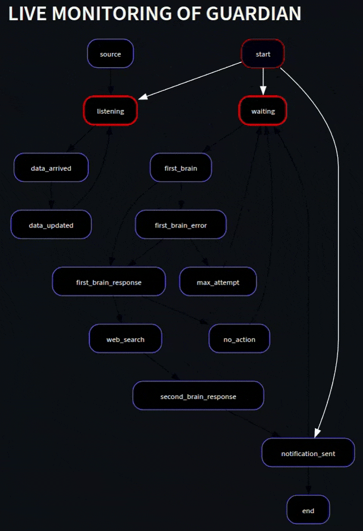
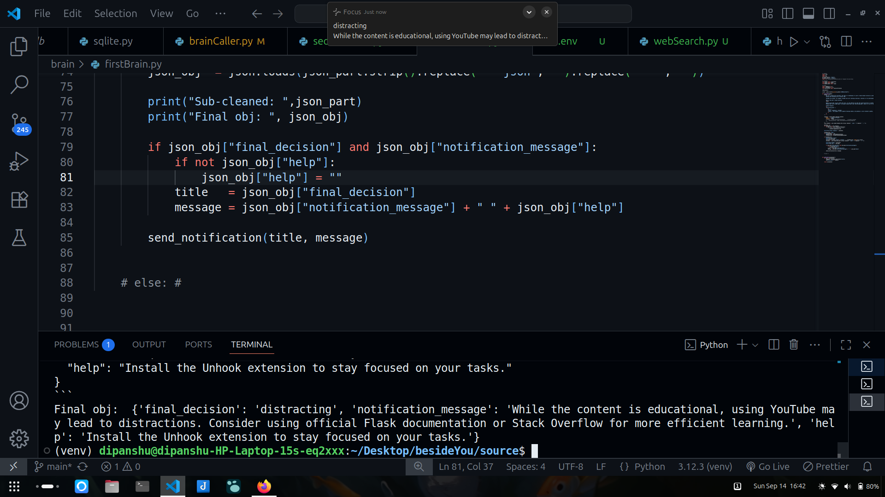
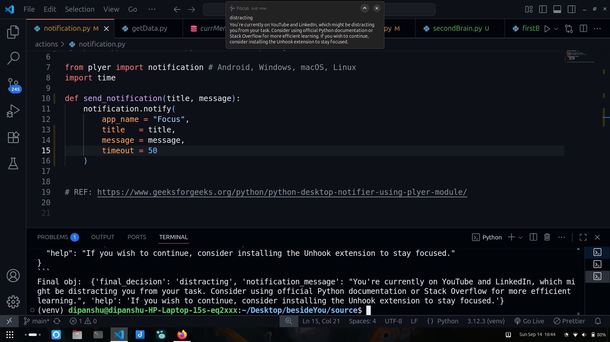
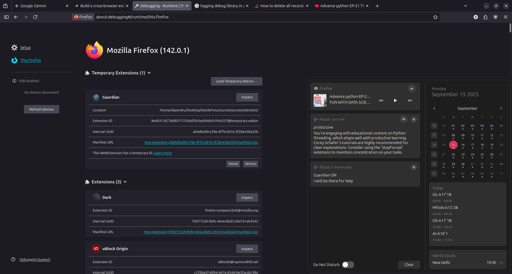
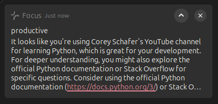

## Introduction
<table>
  <tr>
    <td width="30%">
      
    </td>
    <td width="70%" valign="top">
      <h3>Guardian</h3>
      

         A prototype AI agent that automates personal productivity monitoring
         by analyzing web browsing activity and providing gentle notifications to
         help the user maintain focus.
      

      <ul>
        <li><b>Author: </b>Dipanshu</li>
        <li><b>University: </b>IIT Mandi</li>
        <li><b>Department: </b>Computer science and engineering</li>
        <li><b>Date: </b>September 17, 2025</li>
        <li><b>Version: </b>1.0</li>
      </ul>
    </td>
  </tr>
</table>

## Output
<table>
  <tr>
    <td width="50%">
      
    </td>
    <td width="50%" valign="top">
      
    </td>
  </tr>
  <tr>
    <td width="50%">
      
    </td>
    <td width="50%" valign="top">
      
    </td>
  </tr>
</table>
