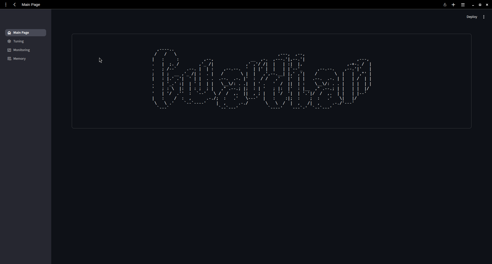
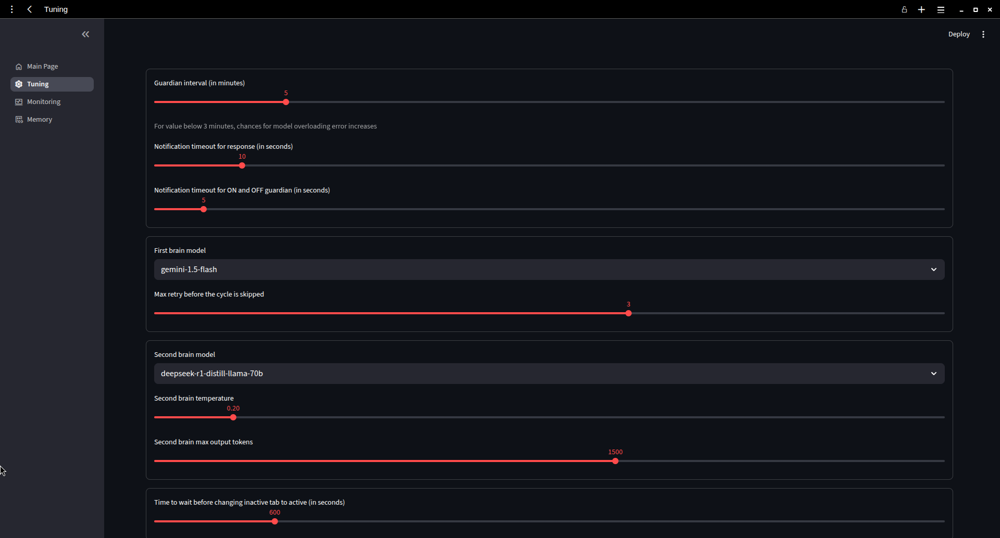
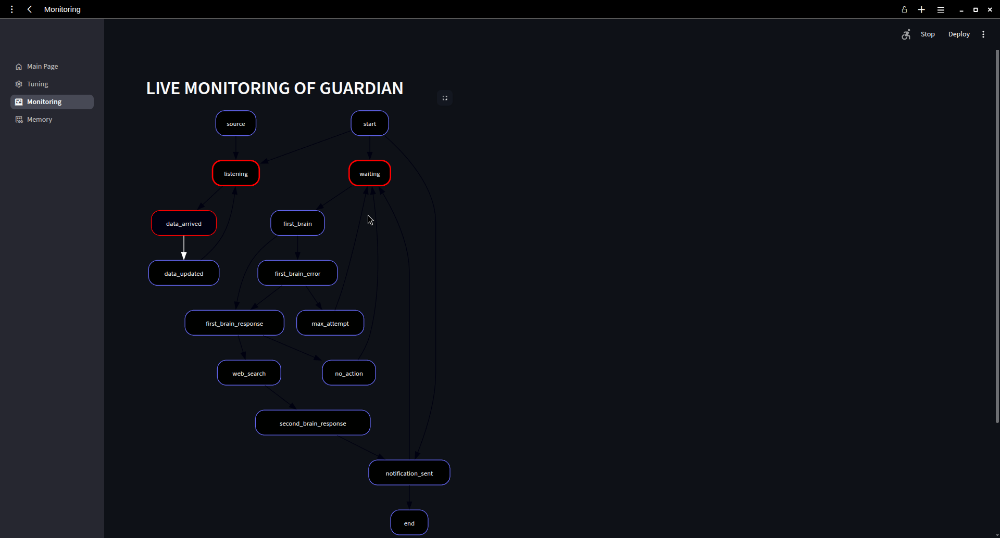
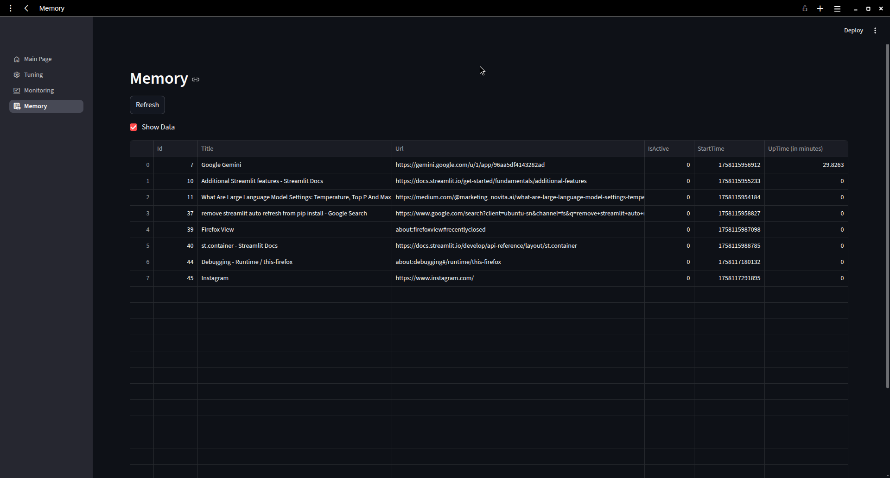

## Introduction
<table>
  <tr>
    <td width="30%">
      
    </td>
    <td width="70%" valign="top">
      <h3>Guardian</h3>
      <p>
         A prototype AI agent that automates personal productivity monitoring
         by analyzing web browsing activity and providing gentle notifications to
         help the user maintain focus.
      </p>
      <ul>
        <li><b>Author: </b>Dipanshu</li>
        <li><b>University: </b>IIT Mandi</li>
        <li><b>Department: </b>Computer science and engineering</li>
        <li><b>Date: </b>September 17, 2025</li>
        <li><b>Version: </b>1.0</li>
      </ul>
    </td>
  </tr>
</table>

## 📑 Quick Index
- [Output](#output)
- [System Architecture](#system-architecture)
- [Technology Stack](#technology-stack)
- [Setup Instructions](#setup-instructions)
- [Deliverables](#deliverables)


## Output
Screenshots Taken during development process.
<table>
  <tr>
    <td width="50%">
      
    </td>
    <td width="50%" valign="top">
      
    </td>
  </tr>
  <tr>
    <td width="50%">
      
    </td>
    <td width="50%" valign="top">
      
    </td>
  </tr>
</table>
Created UI [With streamlit]
<table>
  <tr>
    <td width="50%">
      
    </td>
    <td width="50%" valign="top">
      
    </td>
  </tr>
  <tr>
    <td width="50%">
      
    </td>
    <td width="50%" valign="top">
      
    </td>
  </tr>
</table>

## System Architecture
<table>
  <tr>
     
  </tr>
</table>


### Workflow
1. Data Collection: A Firefox Browser Extension acts as a sensor, collecting data about all open tabs every two minutes and sending it to a local server.

2. Data Ingestion & Persistence: A lightweight Flask server listens for this data and stores it in a local SQLite database, timestamping each entry.

3. Scheduled Trigger: A central scheduling process (run_agent.py) initiates the main reasoning cycle every five minutes.

4. Reasoning & Planning: The agent executes a single-path plan for each cycle.

5. Monitoring: A Streamlit UI provides a live, visual representation of the agent's workflow and internal state by reading from a structured log file. And allow to change wide range of parameters like changing models, notification timeout, scheduling time.

### Design Patterns
1. *Proactive Goal Creator:* The browser extension proactively captures the user's context to help achieve the implicit goal of productivity.

2. *Role-based Cooperation:* The system uses a multi-agent approach where two "brains" have distinct roles: an initial Analyst (Gemini) and a final Reviewer (DeepSeek).

3. *Cross-reflection:* The Second Brain (DeepSeek) reviews the output of the First Brain (Gemini), providing a layer of reflection and correction to improve reasoning certainty.

### Components 
1. **Firefox Extension (extension/):** A JavaScript-based extension that collects open tab information and sends it to the local data connector.

2. **Data Connector (connector/getData.py):** A Flask-based API endpoint that listens for incoming data from the extension and persists it to the database.

3. **Database (database/sqlite.py, runMemory.db):** The persistence layer using SQLite to store raw tab data and analysis results.

4. **Agent Core / Scheduler (run_agent.py):** The system's entry point. It runs the Flask server and schedules the brainCaller function.

5. **Reasoning Brains (brain/):**
    1. ***First Brain (Gemini 1.5 Flash):*** Performs a fast, initial analysis to form a hypothesis about distracting tabs.

    2. ***Second Brain (DeepSeek):*** Performs a final, more nuanced review and has the final say.

6. **Tools (tools/webSearch.py):** An external tool integration to perform a web search for gathering more context on a tab's content.

7. **Actions (actions/notification.py):** Executes the final decision by sending a cross-platform desktop notification to the user.

8. **Monitoring UI (UI/):** A Streamlit web dashboard that provides a live, visual monitor of the agent's execution plan.

## Technology Stack
| Technology                         | Area                | Reason for Choice                                                                                               |
| ---------------------------------- | ------------------- | --------------------------------------------------------------------------------------------------------------- |
| **Python**                         | Backend             | De-facto language for AI/ML; huge ecosystem (`groq`, `google-genai`, `schedule`, etc.) and cross-platform.      |
| **JavaScript (WebExtensions API)** | Extension           | Only way to access browser tabs/events.                               |
| **Flask**                          | API                 | One-file, zero-config REST endpoint for `/log-activity`; lighter than FastAPI for a single route.               |
| **SQLite**                         | Database            | Server-less, file-based, ships with Python → no credentials, clone-and-run.                          |
| **Gemini-1.5-Flash**               | AI (1st brain)      | 1 M token context, **≤ 1 500 RPM** free tier, lowest latency & cost → perfect for high-frequency first pass.    |
| **DeepSeek-R1-Distill-Llama-70b**  | AI (2nd brain)      | 70 B reasoning-tuned model on Groq → **30 RPM / 1 K RPD** quota, **6 K TPM**, far stronger critique than Flash. |
| **Streamlit**                      | Monitor UI          | Pure-Python, 20-line dashboard for table + logs; no JS/HTML boiler-plate.                                       |
| **Graphviz**                       | Workflow diagram    | Generates graphs of agent pipeline at runtime → embed in Streamlit for instant explainability.                 |

## Setup Instructions
The project has two independent parts:
1. **Core Agent (data collection + AI reasoning)**
2. **Optional Monitor UI (real-time dashboard)**

 ### Core Agent
  - Python
  - Mozilla Firefox
  - Git

  NOTE: All commands are to executed from the root folder

  ```bash
      # 1. Clone
      git clone https://github.com/dipanshu849/GaurdianFocus.git
      # 2. Virtual environment
      python3 -m venv venv # check which python or python3
  ```
  ```bash
      # Windows
      .\venv\Scripts\activate
      # macOS / Linux
      source venv/bin/activate
  ```
  ```bash
      # 3. Dependencies
      pip install -r requirements.txt
  ```
  #### Loading extension
  1. Open application menu in firefox
  2. Go to more tools options (at bottom)
  3. Choose remote debugging
  4. Choose 'this firefox' option in the side panel
  5. Click on 'Load temporary add-on'
  6. Go to the extension folder of cloned repo
  7. And choose the manifest.json file
  8. Done

  #### Starting agent
  1. Simple run:
     ```bash
        python3 run_agent.py # check for python or python3
     ```
  2. With more info:
     ```bash
        LOG_LEVEL=DEBUG python3 run_agent.py
     ```
 ### Monitor UI
   #### Extra prerequisites
   - Graphviz system package (needed for the live workflow diagram)
   #### Install graphviz
   | OS               | Command                                                                                     |
    | ---------------- | ------------------------------------------------------------------------------------------- |
    | macOS (Homebrew) | `brew install graphviz`                                                                     |
    | Ubuntu / Debian  | `sudo apt update && sudo apt install graphviz`                                              |
    | Windows (scoop)  | `scoop install graphviz`                                                                    |
   | Windows (winget)  | `winget install graphviz`                                                                    |
    | Windows (manual) | Download installer → **tick “Add to PATH”** or add `C:\Program Files\Graphviz\bin` yourself |
   #### Run dashboard
   - Open second terminal (keep the first one running)
   - ```bash
       streamlit run UI/app.py
     ```

## Deliverables
1. Interaction logs: I are using a work or school account (which not allow public sharing)
   But I have included all the screenshots of interaction logs in the google drive link
    [📂 Google Drive folder](https://drive.google.com/drive/folders/YOUR_FOLDER_ID?usp=sharing](https://drive.google.com/drive/folders/1f1c9BSmiEr-S--Pcgm8P__UhMEN6-3qw?usp=sharing)
